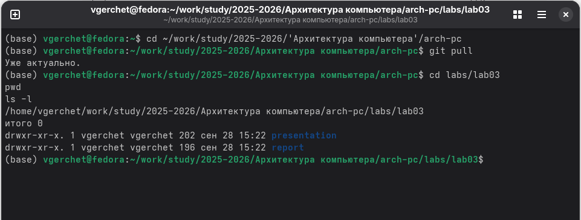
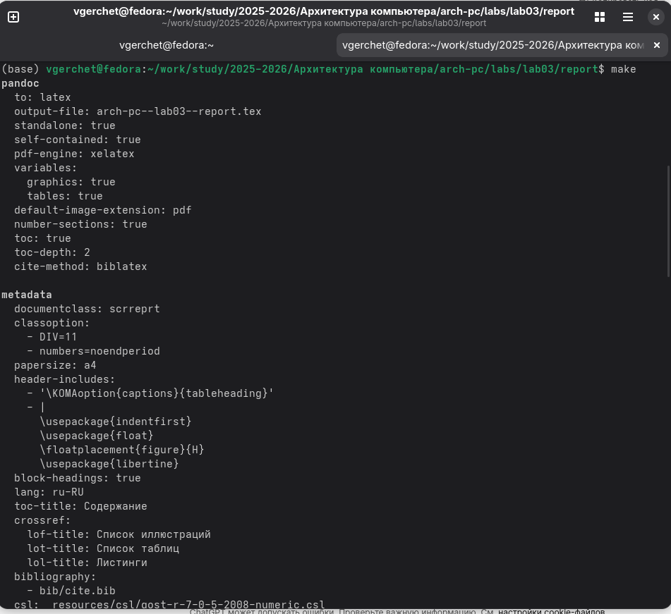
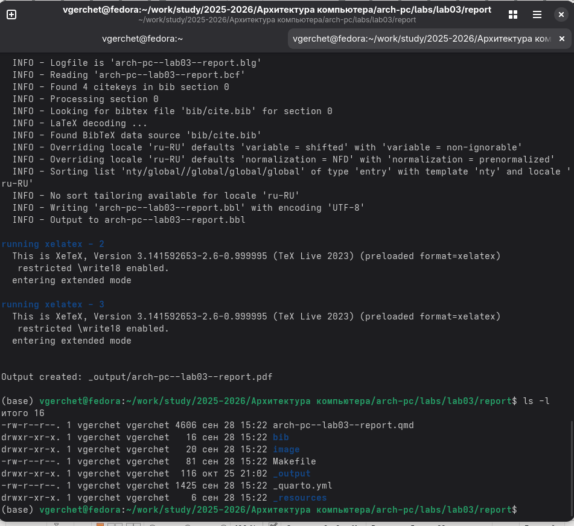
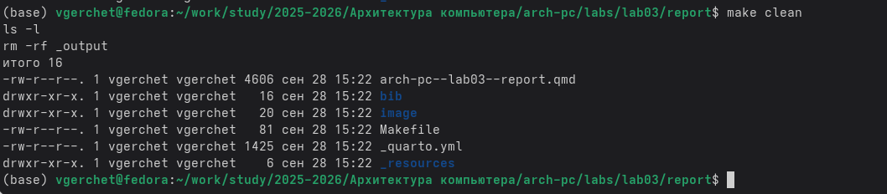
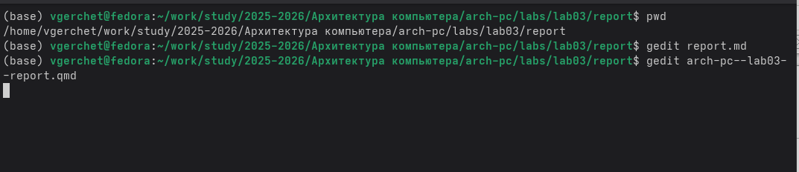

---
author:
  name: Герчет Вячеслав
  affiliation:
    - name: Российский университет дружбы народов
      country: Российская Федерация
      city: Москва
      address: ул. Миклухо-Маклая, д. 6
title: "Лабораторная работа №3"
subtitle: "Работа с системой сборки Make и языком разметки Markdown"
license: "CC BY"
format:
  pdf:
    toc: true
    number-sections: true
    pdf-engine: xelatex
  docx:
    toc: true
    number-sections: true
---

# Цель работы

Ознакомиться с системой автоматической сборки Make и принципами генерации отчётов в формате Markdown.  
Научиться компиляции отчёта в форматы PDF и DOCX с помощью Pandoc и Make, а также публикации материалов на GitHub.

# Задание

1. Ознакомиться с шаблоном отчёта и структурой проекта.  
2. Выполнить сборку отчёта с помощью Make.  
3. Отредактировать отчёт в формате Markdown.  
4. Скомпилировать отчёт в форматы PDF и DOCX.  
5. Разместить результаты работы в GitHub.  
6. Включить в отчёт результаты самостоятельной работы по лабораторной работе №2.

# Теоретическое введение

В лабораторной работе используется система автоматизации сборки Make.  
Make позволяет описать, как из исходных текстов (в нашем случае — Markdown/Quarto) автоматически получать готовые документы (PDF, DOCX и т.д.).

Сборка выполняется по правилам, описанным в файле `Makefile`.  
`Makefile` указывает:
- какие целевые файлы нужно получить (например, `report.pdf`, `report.docx`);
- из каких исходников это берётся (наш `.qmd` отчёт, изображения и т.п.);
- какими инструментами собирать (Pandoc, Quarto, XeLaTeX и т.д.).

Pandoc — это конвертер, который может из Markdown/Quarto автоматически сформировать DOCX и PDF.  
Для PDF дополнительно используется движок XeLaTeX.

Таким образом:
- студент редактирует только один исходный файл (`.qmd`);
- команда `make` создаёт готовый отчёт в нужных форматах;
- командой `git push` отчёт и все материалы выкладываются в репозиторий GitHub.

# Выполнение лабораторной работы

## 4.1 Подготовка рабочего каталога

Сначала я открыл терминал и перешёл в каталог курса `arch-pc`, где находятся все лабораторные работы.  
Далее я выполнил команду `git pull`, чтобы обновить локальный репозиторий и получить все последние изменения.  
После этого я перешёл в каталог лабораторной №3 и с помощью команд `pwd` и `ls -l` убедился, что все необходимые файлы на месте.

{width=80%}

---

## 4.2 Компиляция шаблона отчёта

Затем я запустил команду `make`, которая автоматически собирает отчёт, используя систему Pandoc и движок LaTeX.  
После выполнения команды в каталоге появились файлы `report.pdf` и `report.docx`, созданные на основе шаблона.

{width=80%}

---

## 4.3 Очистка каталога

Чтобы проверить, как работает цель `clean` в `Makefile`, я выполнил команду `make clean`.  
После этого временные и скомпилированные файлы удалились, и в каталоге остались только исходные файлы отчёта.

{width=80%}

---

## 4.4 Редактирование отчёта в Markdown

После проверки работы сборки я открыл исходный файл отчёта `arch-pc--lab03--report.qmd` через текстовый редактор `gedit`.  
В этом файле я изменил автора на себя, добавил цель, задание, теоретическое введение и описание шагов, а также вставил ссылки на свои скриншоты.  
Таким образом я полностью оформил отчёт в формате Markdown.

{width=80%}

---

## 4.5 Финальная сборка отчёта

Когда все изменения были внесены, я снова выполнил команду `make`.  
После этого появились новые версии файлов `report.pdf` и `report.docx`, уже с моими данными и вставленными изображениями.

{width=80%}

---

## 4.6 Проверка результата и открытие отчёта

Чтобы убедиться, что всё собрано корректно, я открыл итоговый файл с помощью команды:
```bash
xdg-open _output/arch-pc--lab03--report.pdf

