---
## Front matter
title: "Отчёт по лабораторной работе №4"
subtitle: "Создание и процесс обработки программ на языке ассемблера NASM"
author: "Герчет Вячеслав, группа НКАбд-03-25"

## Generic options
lang: ru-RU
toc-title: "Содержание"

## Bibliography
bibliography: bib/cite.bib
csl: pandoc/csl/gost-r-7-0-5-2008-numeric.csl

## Pdf output format
toc: true
toc-depth: 2
lof: true
fontsize: 12pt
linestretch: 1.5
papersize: a4
documentclass: scrreprt
## I18n polyglossia
polyglossia-lang:
  name: russian
  options:
    - spelling=modern
    - babelshorthands=true
polyglossia-otherlangs:
  name: english
## I18n babel
babel-lang: russian
babel-otherlangs: english
## Fonts
mainfont: PT Serif
romanfont: PT Serif
sansfont: PT Sans
monofont: PT Mono
mainfontoptions: Ligatures=TeX
romanfontoptions: Ligatures=TeX
sansfontoptions: Ligatures=TeX,Scale=MatchLowercase
monofontoptions: Scale=MatchLowercase,Scale=0.9
## Biblatex
biblatex: true
biblio-style: "gost-numeric"
biblatexoptions:
  - parentracker=true
  - backend=biber
  - hyperref=auto
  - language=auto
  - autolang=other*
  - citestyle=gost-numeric
## Pandoc-crossref LaTeX customization
figureTitle: "Рис."
tableTitle: "Таблица"
listingTitle: "Листинг"
lofTitle: "Список иллюстраций"
lolTitle: "Листинги"
## Misc options
indent: true
header-includes:
  - \usepackage{indentfirst}
  - \usepackage{float}
  - \floatplacement{figure}{H}
---

# Цель работы

Освоить процесс компиляции и сборки программ на языке ассемблера NASM, научиться использовать транслятор NASM и компоновщик LD, а также закрепить практические навыки работы с файлами исходного кода и объектными файлами.

# Задание

Написать две программы:
1. Программа **Hello world** — вывод текста на экран. 
2. Программа **lab4.asm** — аналогичная, но с персонализированным выводом “Герчет Вячеслав”.

# Выполнение лабораторной работы

## Программа Hello world!

Создать файл hello.asm и написать код, выводящий строку 'Hello world!'.  на языке ассемблера NASM (рис. @fig:001).

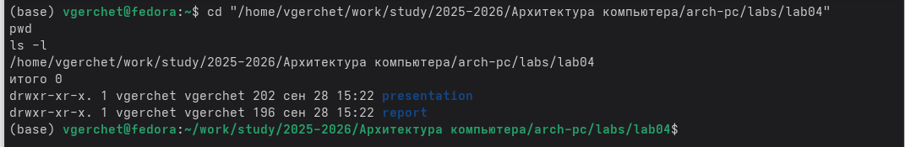{#fig:001 width=70%}

с помощью команды gedit открыл редакторе (рис. @fig:002).

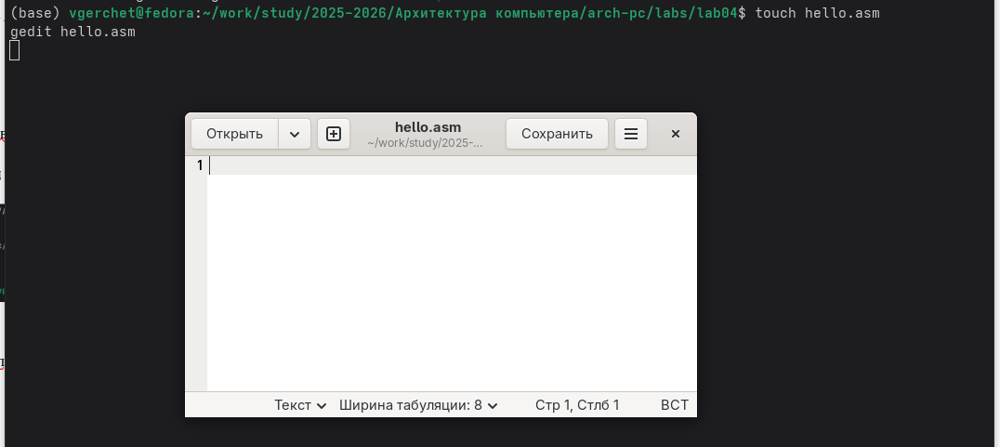{#fig:002 width=70%}

 исходный код программы hello.asm (рис. @fig:003).

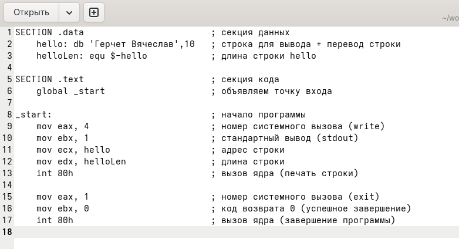{#fig:003 width=70%}

## Транаслятор NASM

Трансляция исходного файла hello.asm в объектный файл hello.o (рис. @fig:004).

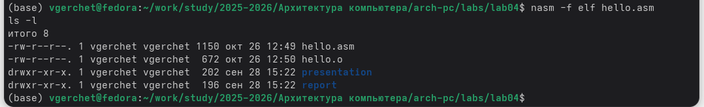{#fig:004 width=70%}

## Расширенный синтаксис командной строки NASM

Компилируем исходный файл (рис. @fig:005).

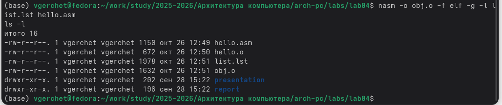{#fig:005 width=70%}

## Компоновщик LD

Выполнить компоновку: ld -m elf_i386 hello.o -o hello. (рис. @fig:006).

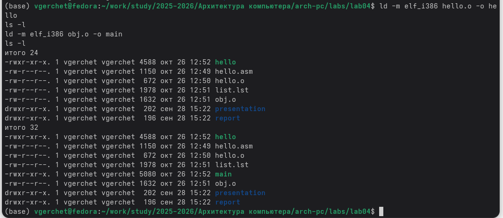{#fig:006 width=70%}

## Запуск исполняемого файла

Запускаем на выполнение созданный исполняемый файл (рис. @fig:07).

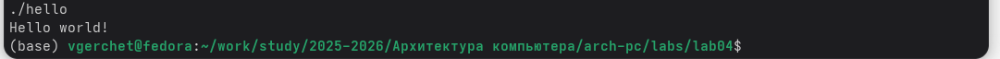{#fig:07 width=70%}

## Задание для самостоятельной работы

Создать копию hello.asm под именем lab4.asm, изменить текст на 'Герчет Вячеслав', выполнить трансляцию, компоновку и запуск.  (рис. @fig:08).

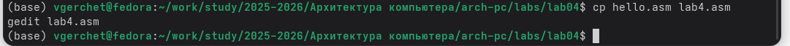{#fig:08 width=70%}

меняю текст на hello: db 'Герчет Вячеслав',10 (рис. @fig:09).

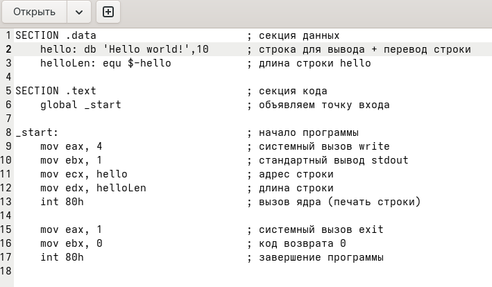{#fig:09 width=70%}

 Компоновка объектного файла в исполняемый файл, запуск программы lab4.asm с персонализированным выводом. (рис. @fig:010).

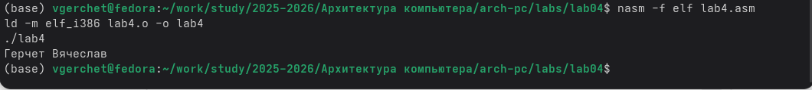{#fig:010 width=70%}

Переходим в каталог лабораторных работ и загружаем файлы на Github (рис. @fig:011).

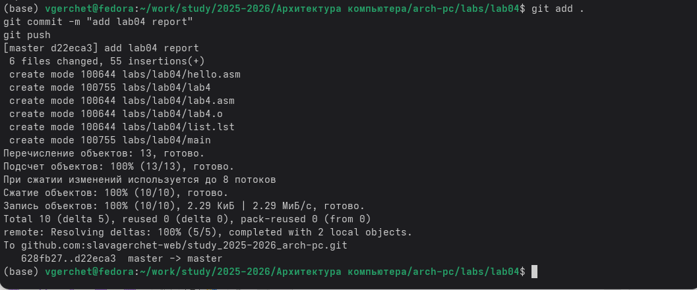{#fig:011 width=70%}

# Выводы

Мы познакомились с языком ассемблера NASM и создали две работающих программы.

